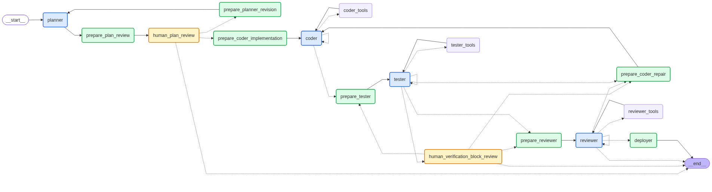

# Multi-Agent SDLC

A sandboxed multi-agent software development workflow built with LangGraph.

The project explores how specialized AI agents can collaborate across the software
development lifecycle, supported by deterministic graph-based orchestration, explicit
role boundaries, controlled tools, persistent state, automated verification, bounded
repair loops, human approval, and deterministic deployment to AWS.

> **Status:** Planner, Coder, Tester, and Reviewer agent nodes are implemented,
> alongside a deterministic Deployer node, persistent workflow state, human plan
> review, verification-block handling, and bounded repair/retest transitions.

## Workflow


### Node Categories

**Agent Nodes** — LLM-driven nodes responsible for the core software development tasks:
`planner`, `coder`, `tester`, `reviewer`

**Preparation Nodes** — deterministic nodes that prepare context and state for subsequent workflow stages:
`prepare_plan_review`, `prepare_coder_implementation`,
`prepare_coder_repair`, `prepare_tester`, `prepare_planner_revision`,
`prepare_reviewer`

**Execution Nodes** — deterministic nodes that perform workflow actions with external side effects:
`deployer`

**Human Review Nodes** — human-in-the-loop nodes that pause workflow execution to collect review, approval, or intervention input:
`human_plan_review`, `human_verification_block`


| Preparation Node | Feeds |
|---|---|
| `prepare_plan_review` | `human_plan_review` |
| `prepare_coder_implementation` | `coder` |
| `prepare_coder_repair` | `coder` |
| `prepare_tester` | `tester` |
| `prepare_planner_revision` | `planner` |
| `prepare_reviewer` | `reviewer` |

### Planner

Creates a structured development plan containing tasks, ownership, dependencies,
target files, assumptions, verification requirements, and acceptance criteria.

### Plan Review

The workflow pauses for human approval before implementation begins.

The plan can be approved, returned to the Planner for revision, or rejected.

Plan approval can optionally be automated through the CLI.

### Coder

Implements Coder-owned tasks using a restricted tool set.

The Coder can create and modify project files, manage allowed dependencies, run
development and application checks, verify containerized applications, and repair
production-code defects reported by the Tester or Reviewer.

Repeated invalid Coder responses are bounded to prevent uncontrolled loops.

### Tester

Independently verifies the implementation against the approved plan and acceptance
criteria.

The Tester can create and run tests, perform linting and type checking, verify builds,
entry points, containerized execution, and project-level quality gates, and request
Coder repair when production-code defects are found.

Verification blocked by environment or tooling limitations is routed for human review
rather than incorrectly treated as an implementation defect.

### Reviewer

Reviews the verified implementation for correctness, maintainability, consistency
with the approved plan, and overall code quality.

The Reviewer can approve the implementation, request Coder repairs when review
findings require changes, or report that the review is blocked.

### Deployer

Deterministically deploys approved applications to a predefined AWS EC2 environment.

The Deployer packages the validated project, uploads the deployment artifact to
Amazon S3, executes the deployment through AWS Systems Manager, starts the
containerized application, and verifies that the deployed application is healthy.

Unlike the other core workflow roles, the Deployer is deterministic and does not use
an LLM.

## Persistence

The project uses two SQLite databases:

```
.data/
├── checkpoints.sqlite
└── workflow_runs.sqlite
```

`checkpoints.sqlite` stores LangGraph checkpoints and workflow state.

`workflow_runs.sqlite` stores application-level run metadata such as thread ID, status, request, project directory, and timestamps.

Persisted workflows can be resumed using their thread ID.
## Running

Install dependencies:

```bash
uv sync
```

Start a new workflow:

```bash
uv run multi-agent-sdlc
```

Resume a workflow:

```bash
uv run multi-agent-sdlc --resume <thread-id>
```

Resume execution from a specific checkpoint:

```bash
uv run multi-agent-sdlc \
  --resume <thread-id> \
  --checkpoint-id <checkpoint-id>
```  

Automatically approve plan review:

```bash
uv run multi-agent-sdlc --auto-approve-plan
```

Show CLI options:

```bash
uv run multi-agent-sdlc --help
```
## Implemented

* Planner, Coder, Tester, and Reviewer agents
* Deterministic Deployer node
* Human plan review
* Human verification-block review
* Optional automatic plan approval
* Coder–Tester repair and retest loop
* Reviewer-driven repair loop
* Restricted tool execution
* Sandboxed project directories
* Persistent LangGraph checkpoints
* Persistent workflow metadata
* Thread-ID-based workflow resume
* Checkpoint-ID-based workflow replay and branching
* Bounded invalid-response handling
* Deterministic AWS deployment to EC2 using S3, Systems Manager, and Docker Compose
* Post-deployment application health verification

## Planned

* Additional failure-recovery policies
* Generic post-deployment initialization hooks
* Workflow state schema review and simplification
* LLM context and summary-history optimization
* Workflow and deployment refactoring
